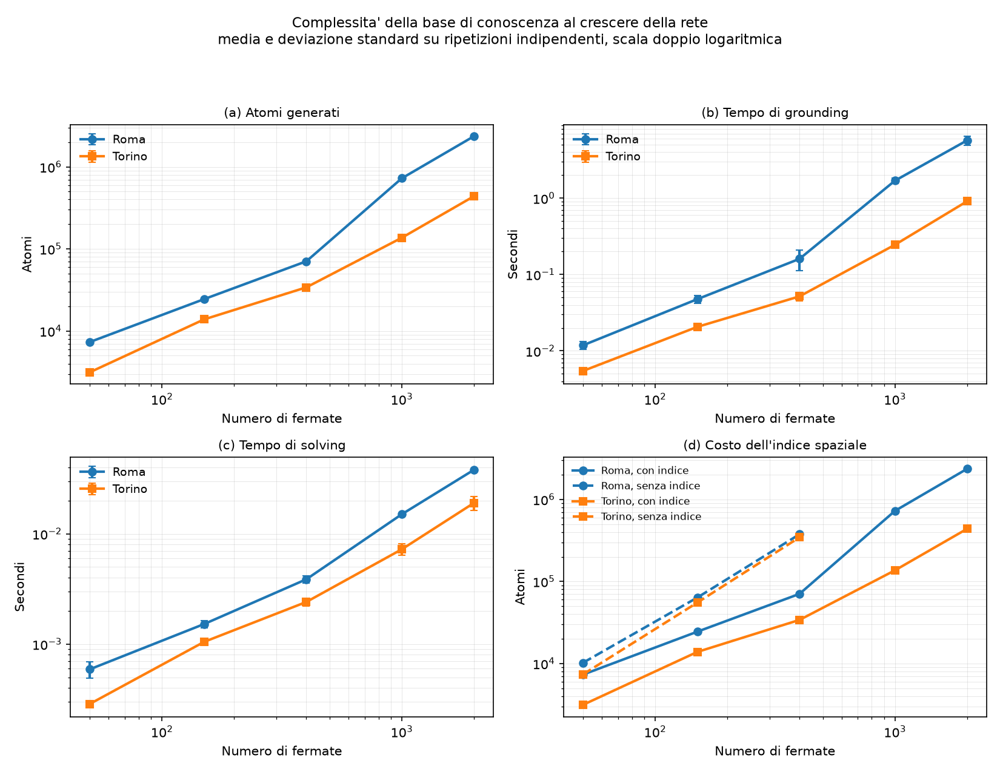
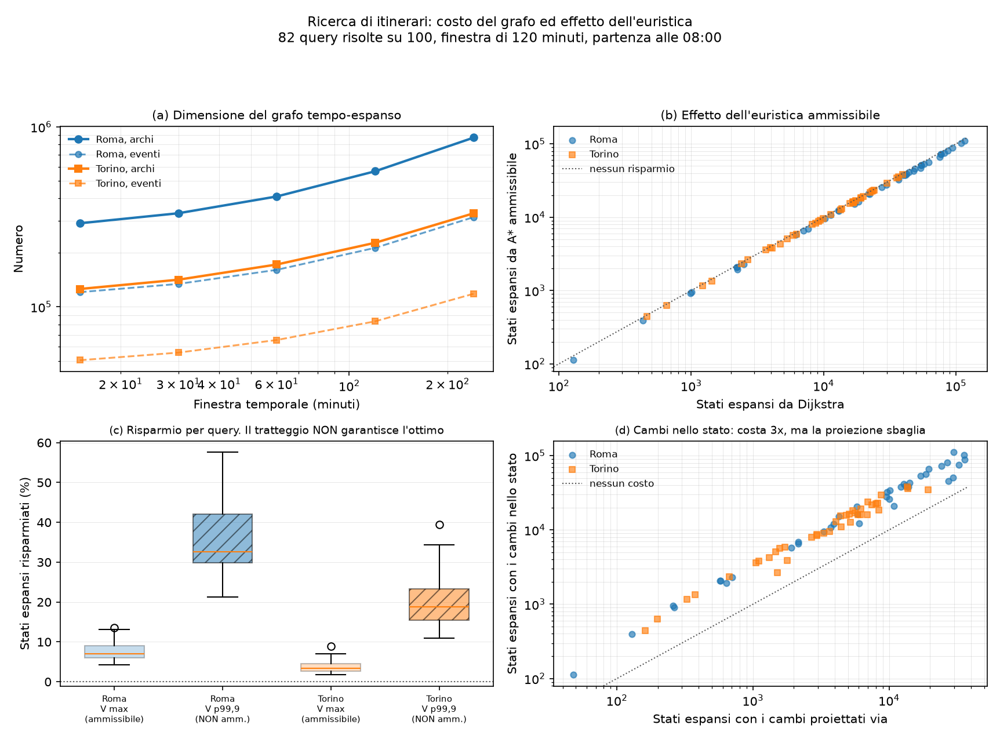
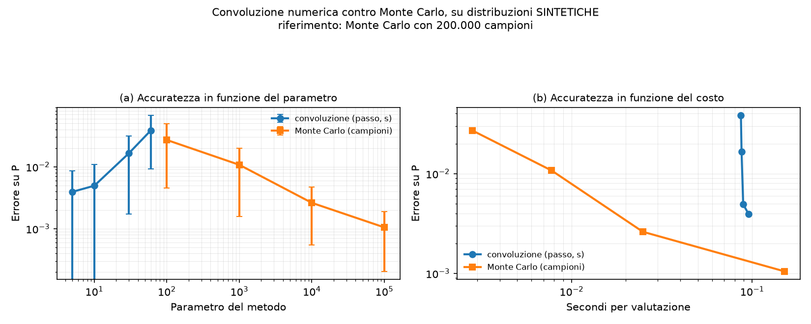
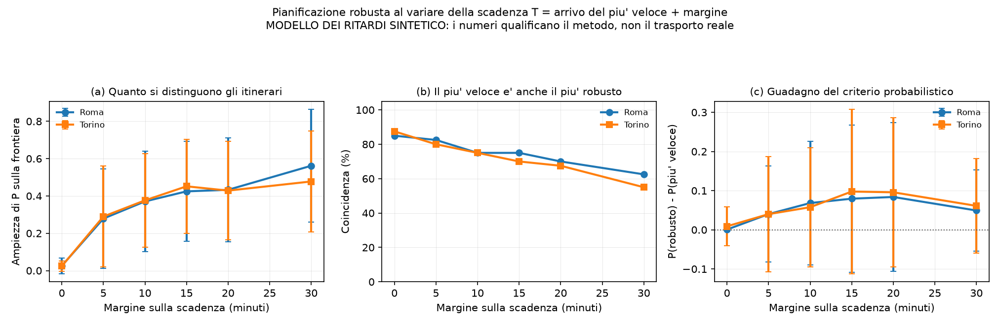

# Un pianificatore di viaggi robusto ai ritardi

Documento di progetto per il corso di Ingegneria della Conoscenza.

> Documento in costruzione. Le sezioni presenti sono quelle chiuse dalle fasi
> gia' concluse; l'introduzione, le sezioni sulla ricerca, sul modello
> probabilistico e sulla valutazione sperimentale arriveranno con le rispettive
> fasi.

---

## Rappresentazione della conoscenza

### Il problema che la base di conoscenza deve risolvere

Un pianificatore di viaggi ha bisogno di sapere, per ogni coppia di fermate, se
un passeggero possa passare dall'una all'altra e quanto tempo gli occorra come
minimo. Questa relazione, che chiameremo di *trasbordo*, e' il fondamento su cui
poggia tutto il resto del progetto: il grafo tempo-espanso della Fase 2 la usa
per costruire gli archi di cambio, e il calcolo di probabilita' della Fase 4 la
usa per stabilire quando una coincidenza sia da considerarsi persa.

La circostanza che ha determinato la forma di questa parte del lavoro e' che la
relazione di trasbordo **non esiste nei dati di partenza**. Lo standard GTFS
prevede un file facoltativo, `transfers.txt`, in cui un'azienda puo' dichiarare
esplicitamente quali cambi siano possibili e con quale tempo minimo. Abbiamo
verificato il contenuto degli archivi di entrambe le aziende del progetto, Roma
Mobilita' e GTT di Torino: nessuna delle due lo pubblica. L'archivio di Roma
contiene `agency.txt`, `calendar_dates.txt`, `routes.txt`, `shapes.txt`,
`stop_times.txt`, `stops.txt` e `trips.txt`; quello di Torino aggiunge alcuni
file non standard sulle tariffe e sui quadri orari, ma neppure lui contiene i
trasbordi.

Questa assenza si e' rivelata la migliore garanzia possibile contro l'obiezione
che una base di conoscenza sia soltanto un database interrogato con un'altra
sintassi. Non esiste alcuna tabella dei trasbordi da leggere, filtrare o
giuntare: l'intera relazione va **derivata** a partire da cio' che i dati
effettivamente contengono, cioe' le coordinate delle fermate, la gerarchia che
lega le banchine alle stazioni, l'accessibilita' dichiarata di ciascuna fermata e
l'elenco delle linee che vi transitano. Ogni trasbordo che il pianificatore
utilizzera' e' una conclusione inferita, non un dato letto.

### I fatti e la loro forma

La base di conoscenza riceve dal GTFS otto predicati. Le fermate fisiche, con la
loro posizione e la cella dell'indice spaziale a cui appartengono; il legame fra
una banchina e la stazione che la contiene; il valore di accessibilita' dichiarato
per ciascuna fermata secondo la codifica dello standard, dove lo zero significa
"informazione non disponibile" e non "non accessibile"; l'elenco delle coppie
linea-fermata; e, quando esistono, i trasbordi dichiarati dall'azienda e le
segnalazioni contingenti di ascensori fuori servizio.

Due trasformazioni avvengono prima che i fatti raggiungano il programma logico, e
vale la pena dichiarare perche' non spostino conoscenza fuori dalla base. La
prima e' che gli identificativi testuali delle fermate diventano numeri interi:
la corrispondenza e' biunivoca e viene conservata, il risultato si ritraduce
esattamente, e il guadagno e' soltanto di velocita' nel grounding. La seconda e'
che le coordinate geografiche diventano metri interi su una proiezione piana
locale centrata sul baricentro delle fermate della citta'. Anche questo e' un
cambio di unita' di misura, non di contenuto: e' l'analogo del conservare gli
orari in secondi anziche' nella forma `HH:MM:SS`. La regola che stabilisce
*quali* coppie di fermate costituiscano un trasbordo resta interamente dentro il
programma logico, e opera sulle coordinate cosi' come le riceve.

### Il tempo minimo di trasbordo come eredita' difettibile

La regola piu' significativa del progetto e' quella che stabilisce quanto tempo
occorra come minimo per un cambio. Il valore non e' memorizzato da nessuna parte
e non e' unico: dipende da che tipo di trasbordo si tratti, e le fonti di
informazione hanno una gerarchia di autorevolezza. Se l'azienda ha dichiarato un
tempo per quella specifica coppia, vale quello. In assenza di una dichiarazione,
se le due fermate sono banchine della stessa stazione vale il tempo di
percorrenza interno alla stazione, piu' lungo del semplice cammino perche'
comprende sottopassi, scale e tornelli. In assenza di entrambe le condizioni,
vale il tempo di cammino all'aperto piu' un margine.

Le tre regole che realizzano questa gerarchia sono le seguenti.

```prolog
tempo_minimo_trasbordo(F1, F2, T) :-
    dichiarato(F1, F2, T).

tempo_minimo_trasbordo(F1, F2, tempo_stazione) :-
    stessa_stazione(F1, F2),
    not dichiarato(F1, F2, _).

tempo_minimo_trasbordo(F1, F2, T + margine_piedi) :-
    tempo_piedi(F1, F2, T),
    not dichiarato(F1, F2, _),
    not stessa_stazione(F1, F2).
```

Il meccanismo che realizza la priorita' e' interamente affidato ai tre `not`: una
regola di livello inferiore si applica soltanto quando nessuna regola piu'
specifica ha gia' concluso. E' la struttura classica dell'eredita' difettibile,
quella per cui un default vale finche' non interviene un'eccezione piu' precisa.

Un'interrogazione relazionale puo' riprodurre questo risultato, ma solo scrivendo
la gerarchia delle priorita' dentro la query stessa, tipicamente sotto forma di
una catena di `COALESCE` o di una sequenza di `LEFT JOIN` ordinati. La differenza
non e' di eleganza ma di collocazione della conoscenza: in quel caso la gerarchia
vive nel codice dell'interrogazione, e aggiungere un livello significa riscrivere
la query. Qui la gerarchia e' dichiarata nella base di conoscenza, e aggiungere un
livello significa aggiungere una regola senza toccare le altre. Il collaudo di
questa proprieta' verifica esattamente la parte non riducibile: dichiarando un
tempo per la sola direzione da `A1` verso `A2`, quella direzione assume il valore
dichiarato mentre la direzione opposta, non dichiarata, resta governata dalla
regola della stazione. La sovrascrittura e' puntuale, come dev'essere un
default.

### L'accessibilita' come conoscenza non monotona

La seconda regola riportata riguarda l'accessibilita' di un trasbordo per un
passeggero a ridotta mobilita'.

```prolog
accessibile(F1, F2) :-
    trasbordo_ammissibile(F1, F2, _),
    fermata_accessibile(F1),
    fermata_accessibile(F2),
    not eccezione_accessibilita(F1, F2).

eccezione_accessibilita(F1, F2) :-
    tempo_piedi(F1, F2, T),
    T > tempo_piedi_max_sedia.

eccezione_accessibilita(F1, F2) :-
    trasbordo_ammissibile(F1, F2, _),
    ascensore_fuori_servizio(F1).
```

Qui la proprieta' rilevante e' la **non monotonia**: aggiungere un fatto alla base
di conoscenza *rimuove* conclusioni che erano gia' state derivate. Dichiarando che
l'ascensore della fermata `A1` e' fuori servizio, quattro trasbordi che risultavano
accessibili smettono di esserlo, e nessuno ne prende il posto. Nessuna
interrogazione relazionale positiva ha questo comportamento, per una ragione
strutturale e non implementativa: in algebra relazionale l'aggiunta di tuple a una
relazione non puo' mai ridurre il risultato di una query positiva. Il
comportamento e' verificato da un test che confronta l'insieme delle conclusioni
prima e dopo l'aggiunta del fatto, e controlla non solo che quattro conclusioni
siano sparite, ma anche che nessuna sia comparsa.

Vale la pena notare che le eccezioni non sono tutte dichiarate: la prima e'
*derivata*. Un trasbordo a piedi diventa inaccessibile in forza della propria
distanza, senza che nessuno debba annotarlo, perche' la regola confronta il tempo
di cammino con una soglia. Anche l'antecedente `fermata_accessibile` e' a sua
volta un'eredita' con default, perche' lo standard GTFS prescrive che il valore
zero su una banchina significhi "eredita dalla stazione".

### La raggiungibilita' come chiusura transitiva

La terza regola e' la definizione ricorsiva della raggiungibilita'.

```prolog
raggiungibile(F, F) :- fermata(F).

raggiungibile(F1, F3) :-
    raggiungibile(F1, F2),
    trasbordo_ammissibile(F2, F3, _).
```

Due fermate sono collegate se esiste una catena di trasbordi che porti dall'una
all'altra, di lunghezza qualsiasi. La ricorsione non e' un artificio: il numero di
cambi necessari a collegare due punti di una rete non e' noto in anticipo e
dipende dalla topologia della citta'. Il collaudo verifica proprio la parte che
solo la ricorsione puo' produrre, disponendo quattro fermate in fila a duecento
metri l'una dall'altra, sotto la soglia di duecentocinquanta metri per le coppie
adiacenti e sopra per quelle a un posto di distanza: nessun trasbordo diretto
collega la prima alla terza, eppure la chiusura le collega, e collega anche la
prima alla quarta.

Una variante della stessa regola calcola la chiusura sui soli trasbordi
accessibili. Non e' una duplicazione: e' un'altra domanda, perche' un percorso
esistente per un passeggero qualsiasi puo' non esistere per un passeggero in
sedia a rotelle, e distinguere le due raggiungibilita' e' precisamente il tipo di
conoscenza che il progetto vuole rappresentare.

### I vincoli di integrita'

Il quarto elemento riportato e' un vincolo.

```prolog
:- fermata(F),
   #count { F2 : trasbordo_a_piedi(F, F2) } > grado_massimo_plausibile.

:- trasbordo_ammissibile(F1, F2, T), tempo_piedi(F1, F2, TP), T < TP.
```

Un vincolo di integrita' non filtra righe: **rifiuta il modello**. Se una sola
coppia di fermate lo viola, il programma non ha alcuna risposta, e non una
risposta piu' corta. E' una condizione sull'intera interpretazione, di natura
diversa da qualunque clausola `WHERE`, e serve a garantire che cio' che esce dalla
base di conoscenza sia coerente per costruzione anziche' per controllo a valle.

Nello scrivere questa parte abbiamo scartato alcuni vincoli che avevamo
inizialmente formulato, come il divieto per una fermata di essere trasbordo di se
stessa, perche' la costruzione delle regole li rende impossibili per definizione:
un vincolo che non puo' mai essere violato non e' logica, e' un commento
travestito da logica. I quattro rimasti sono stati scelti perche' possono davvero
scattare, e ciascuno corrisponde a un difetto documentato dei dati aperti. Il
primo dei due riportati intercetta le fermate prive di coordinate, che nei feed
reali finiscono tutte nello stesso punto e formerebbero un nodo di scambio
inesistente ma enorme; il secondo intercetta i tempi di trasbordo dichiarati piu'
brevi del tempo materialmente necessario a percorrere la distanza a piedi, che
renderebbero il pianificatore sistematicamente troppo fiducioso e produrrebbero,
in Fase 5, coincidenze perse senza spiegazione apparente. Tutti e quattro sono
collaudati costruendo il dato che li viola e verificando che il programma diventi
insoddisfacibile, e che torni soddisfacibile disattivando i soli vincoli.

### Dove sta la negazione e perche' e' stratificata

La negazione per fallimento compare in cinque punti: nelle due regole di
sovrascrittura del tempo minimo, nella regola dell'accessibilita' e nella
definizione di trasbordo utile, che chiede l'esistenza di una linea servita dalla
fermata di arrivo e non servita da quella di partenza.

In tutti i casi la negazione e' **stratificata**, e la verifica e' diretta.
`dichiarato` e' un fatto in ingresso e non dipende da nulla. `stessa_stazione`
dipende soltanto da `in_stazione`, anch'esso un fatto in ingresso.
`eccezione_accessibilita` dipende da `tempo_piedi`, da `trasbordo_ammissibile` e
dal fatto contingente sugli ascensori, ma non da `accessibile`. `serve` e' un
fatto in ingresso. Nessuno dei predicati che compaiono negati dipende, nemmeno
per via indiretta, dal predicato che lo nega: il grafo delle dipendenze non
contiene percio' alcun ciclo che attraversi una negazione, e il programma
ammette un unico modello stabile ben definito. E' questa proprieta' a garantire
che la base di conoscenza abbia una risposta sola, e non un insieme di risposte
alternative fra cui scegliere.

L'unica ricorsione presente, quella della raggiungibilita', e' puramente
positiva, quindi non interferisce con la stratificazione.

### L'indice spaziale

La regola del trasbordo a piedi confronta coppie di fermate. Confrontarle tutte
significa istanziare un numero di atomi quadratico: sulle 8.301 fermate di Roma
sono circa 69 milioni di coppie, e il grounding non termina in tempo utile. La
base di conoscenza usa percio' un indice spaziale: ogni fermata riceve una cella
di una griglia regolare, calcolata dalle sue coordinate, e la regola confronta
soltanto le fermate che si trovano nella stessa cella o in una delle otto
adiacenti.

E' importante dichiarare esplicitamente che cosa sia e che cosa non sia questo
accorgimento. Non e' clustering: non c'e' nulla di appreso, nessun centroide,
nessuna funzione obiettivo, nessuna scelta dipendente dai dati. E'
un'indicizzazione deterministica sulle coordinate, l'equivalente spaziale di un
indice su una colonna di una tabella.

Soprattutto, **non altera la semantica della regola**, e la ragione e'
geometrica. Il lato della cella e' posto uguale alla soglia di cammino: due
fermate che distino meno della soglia non possono quindi cadere in celle non
adiacenti, e nessun trasbordo puo' sfuggire al confronto. L'insieme dei trasbordi
derivati e' percio' identico a quello che si otterrebbe confrontando tutte le
coppie. Poiche' un'argomentazione geometrica puo' sempre nascondere un errore, la
proprieta' e' anche verificata per via sperimentale: il programma logico espone
un interruttore che sostituisce la regola indicizzata con quella esaustiva, e la
misura della sezione seguente confronta i due insiemi di trasbordi su ogni
dimensione in cui entrambe le varianti sono eseguibili. Sono risultati identici
in tutti i casi.

### Il calendario di servizio, e una scoperta che ha cambiato il modulo

La base di conoscenza lavora sulla topologia della rete e non sul calendario, ma
il calendario e' un prerequisito di tutto il resto, ed e' opportuno riferire qui
una circostanza emersa dai dati che ha modificato il progetto del modulo che lo
gestisce.

Lo standard GTFS prevede due modi complementari di dichiarare quando una corsa
circoli. Il file `calendar.txt` esprime una regola settimanale con un periodo di
validita': questa corsa circola dal lunedi' al venerdi' fra due date. Il file
`calendar_dates.txt` esprime eccezioni puntuali a quella regola, additive o
sottrattive. Lo standard richiede che almeno uno dei due sia presente, ma non
entrambi.

Le due aziende del progetto usano i due regimi opposti. Torino pubblica
`calendar.txt` con 1.106 servizi e `calendar_dates.txt` con 34.758 eccezioni,
cioe' la forma canonica. Roma **non pubblica affatto** `calendar.txt`: ogni
singolo giorno di servizio e' elencato come eccezione additiva, e le 4.707 righe
di `calendar_dates.txt` sono l'unica fonte del calendario. Entrambe le scelte
sono conformi.

La conseguenza pratica e' che un modulo scritto sull'assunzione implicita che
`calendar.txt` esista funzionerebbe perfettamente su Torino e restituirebbe zero
corse attive su Roma, senza sollevare alcuna eccezione e senza somigliare in alcun
modo a un errore. Avere due citta' con regimi opposti ha trasformato una
possibile fonte di errore silenzioso in un caso di prova: la funzione che
determina i servizi attivi parte da un insieme vuoto quando la regola settimanale
manca, applica le aggiunte e infine le rimozioni, in quest'ordine, perche' una
rimozione deve poter cancellare anche un servizio introdotto da un'aggiunta dello
stesso giorno.

Alla stessa categoria appartiene il trattamento degli orari oltre la mezzanotte.
Il GTFS ammette e usa regolarmente valori come `25:30:00`, che indicano l'una e
mezza di notte del giorno successivo ma appartenenti al giorno di servizio
precedente. Riportarli sotto le ventiquattro ore, che e' la normalizzazione
istintiva, sposta silenziosamente tutte le corse notturne sul giorno sbagliato. Il
modulo li conserva percio' come secondi non normalizzati, e traduce un orario in
un istante reale seguendo la definizione della specifica, secondo cui i tempi si
misurano da "mezzogiorno meno dodici ore" del giorno di servizio. Nei giorni
ordinari questa definizione coincide con la mezzanotte; nei due giorni all'anno in
cui cambia l'ora legale no, e la differenza e' esattamente un'ora su tutte le
corse della giornata.

### Che cosa i dati non contengono, e cosa ne consegue

Eseguendo la base di conoscenza sulle reti complete e' emerso un risultato
negativo che vale la pena riportare per intero, perche' riguarda il rapporto fra
la generalita' delle regole e la poverta' dei dati su cui vengono applicate.

Delle 8.301 fermate di Roma, **tutte** dichiarano `wheelchair_boarding` uguale a
zero, che nella codifica dello standard significa "informazione non
disponibile"; lo stesso vale per il campo corrispondente su tutte le 179.177
corse. Inoltre, **nessuna** fermata di Roma dichiara una `parent_station`: la
gerarchia delle stazioni, nell'archivio di Roma, semplicemente non esiste. Torino
si comporta diversamente: 2.722 fermate sono dichiarate accessibili, 1.075
esplicitamente non accessibili e 3.276 senza informazione, e 47.023 corse su
60.580 sono dichiarate accessibili; ma anche li' soltanto due fermate su 7.073
appartengono a una stazione.

Le conseguenze si leggono direttamente nella Tabella 5. Su Roma la regola
dell'accessibilita' deriva **zero** trasbordi accessibili: non perche' sia
sbagliata, ma perche' il suo antecedente non e' mai soddisfatto, dal momento che
nessuna fermata risulta accessibile e non esiste alcuna stazione da cui ereditare
il dato. Su Torino la stessa regola funziona e deriva 7.382 trasbordi accessibili
su 21.130, cioe' poco piu' di un terzo. Quanto alla gerarchia dei tempi minimi,
il suo primo livello non riceve alcun fatto su nessuna delle due citta', perche'
nessuna pubblica `transfers.txt`, e il secondo livello si applica a due sole
fermate in tutto il progetto: in pratica, su questi dati, l'eredita' difettibile
collassa quasi ovunque sul suo terzo livello, quello del cammino all'aperto.

Sarebbe disonesto presentare come funzionante una gerarchia a tre livelli di cui,
sul campo, ne opera stabilmente uno solo. Va detto invece con precisione che cosa
questo dimostri e che cosa no. Dimostra che la formulazione e' piu' generale dei
dati disponibili, il che e' una scelta deliberata: la base di conoscenza e'
scritta per il formato GTFS e non per due archivi particolari, e su un'azienda
che pubblichi `transfers.txt` e una gerarchia di stazioni i primi due livelli
entrerebbero in funzione senza modificare una riga. Non dimostra che quei livelli
siano utili in pratica su Roma e Torino, perche' su Roma e Torino non lo sono. Il
loro collaudo e' percio' affidato a dati costruiti, ed e' l'unica forma di
verifica possibile finche' non si aggiunga al progetto una terza citta' con un
archivio piu' ricco.

C'e' infine una conseguenza per la valutazione sperimentale delle fasi
successive. La distinzione fra `raggiungibile` e `raggiungibile_accessibile`, che
sul piano della rappresentazione e' una delle parti piu' interessanti, e'
misurabile soltanto su Torino. Ogni risultato sull'accessibilita' che comparira'
nelle fasi successive andra' quindi riferito a Torino, e non alla media delle due
citta'.

### Limiti di questa rappresentazione

Tre limiti vanno dichiarati. Il primo e' che il tempo di cammino e' discretizzato
in quattro bande anziche' calcolato con continuita': e' una scelta di modello,
motivata dal fatto che un tempo di trasbordo ha senso al mezzo minuto e non al
metro, ma resta un'approssimazione. Il secondo e' che la distanza fra due fermate
e' quella in linea d'aria, non quella effettivamente percorribile a piedi: la base
di conoscenza non dispone del grafo stradale, e in presenza di una ferrovia o di
un fiume fra due fermate vicine il tempo derivato e' ottimistico. Il terzo, discusso per esteso
poco sopra, e' che due dei tre livelli della gerarchia dei tempi minimi non
ricevono alcun fatto da queste due citta', e che su Roma la regola
dell'accessibilita' non deriva nulla per assenza del dato di partenza.

---

## Complessita' della base di conoscenza

### Protocollo di misura

La misura risponde a una domanda pratica: fino a che dimensione di rete questa
base di conoscenza resta utilizzabile, e quale delle sue regole ne determina il
costo. Sono state misurate cinque dimensioni crescenti, da cinquanta a duemila
fermate, su entrambe le citta', con tre ripetizioni indipendenti per ogni
combinazione. Per ciascuna esecuzione si registrano il numero di atomi generati,
il tempo di grounding e il tempo di solving, tenuti separati perche' misurano due
cose diverse: il primo e' il costo di istanziare le regole sui dati, il secondo
quello di risolvere il programma proposizionale che ne risulta.

Le sottoreti sono ottenute per **prossimita' geografica**: si prendono le N
fermate piu' vicine a un centro fisso. Il centro non e' stato scelto a mano ma
derivato dai dati, come la fermata piu' vicina al baricentro geometrico di tutte
le fermate della citta'; per Roma e' la fermata 70841, S. SABA/AVENTINO, per
Torino la 962, Fermata 1873 - PUGLIA C.3. La scelta del campionamento per
prossimita' anziche' casuale non e' neutra e va motivata: cinquanta fermate
estratte a sorte fra le ottomila di Roma finirebbero sparse su tutta la citta', a
chilometri l'una dall'altra, e non genererebbero quasi nessun trasbordo a piedi.
La curva misurerebbe il costo di un problema che non somiglia a quello vero. Il
campionamento per prossimita' conserva invece la densita' reale della rete, ed e'
inoltre monotono, nel senso che un campione piu' grande contiene quello piu'
piccolo: senza questa proprieta' i punti della curva non sarebbero confrontabili
fra loro, perche' misurerebbero reti diverse anziche' la stessa rete a dimensioni
diverse. Il prezzo va dichiarato: i risultati valgono per una porzione connessa e
densa di rete, e non sono estrapolabili a un campione sparso di pari cardinalita'.

Una precisazione metodologica sulle deviazioni standard riportate. Il numero di
atomi e quello di regole sono grandezze **deterministiche**: a parita' di dati e
di programma, clingo genera sempre la stessa istanziazione. La loro deviazione
standard sulle tre ripetizioni e' percio' nulla per costruzione, e riportarla
serve unicamente a documentare che le ripetizioni sono state effettivamente
eseguite. La variabilita' reale sta nei tempi, che dipendono dal carico della
macchina, ed e' li' che la deviazione standard porta informazione.

### Risultati

Tabella 1 - Roma, media e deviazione standard su tre ripetizioni.

| Fermate | Atomi | Grounding (s) | Solving (s) | Trasbordi derivati |
| ---: | ---: | ---: | ---: | ---: |
| 50 | 7.334 ± 0 | 0,012 ± 0,001 | 0,0006 ± 0,0001 | 436 |
| 150 | 24.463 ± 0 | 0,048 ± 0,006 | 0,0015 ± 0,0001 | 1.096 |
| 400 | 70.612 ± 0 | 0,160 ± 0,048 | 0,0039 ± 0,0003 | 2.738 |
| 1000 | 724.410 ± 0 | 1,692 ± 0,139 | 0,0150 ± 0,0003 | 7.232 |
| 2000 | 2.358.444 ± 0 | 5,707 ± 0,753 | 0,0380 ± 0,0008 | 13.938 |

Tabella 2 - Torino, media e deviazione standard su tre ripetizioni.

| Fermate | Atomi | Grounding (s) | Solving (s) | Trasbordi derivati |
| ---: | ---: | ---: | ---: | ---: |
| 50 | 3.141 ± 0 | 0,005 ± 0,000 | 0,0003 ± 0,0000 | 164 |
| 150 | 13.862 ± 0 | 0,021 ± 0,000 | 0,0010 ± 0,0000 | 688 |
| 400 | 34.018 ± 0 | 0,052 ± 0,006 | 0,0024 ± 0,0002 | 1.616 |
| 1000 | 136.729 ± 0 | 0,245 ± 0,012 | 0,0072 ± 0,0008 | 4.498 |
| 2000 | 438.374 ± 0 | 0,910 ± 0,042 | 0,0190 ± 0,0029 | 9.542 |



**Figura 1.** Costo della base di conoscenza al crescere del numero di fermate,
in scala doppio logaritmica, per le due citta'. I pannelli (a), (b) e (c)
riportano rispettivamente gli atomi generati, il tempo di grounding e il tempo di
solving, come media su tre ripetizioni indipendenti con barre di deviazione
standard; sugli atomi le barre sono nulle per costruzione, trattandosi di una
grandezza deterministica. Il pannello (d) confronta la variante con indice
spaziale, a linea continua, con quella che confronta tutte le coppie di fermate,
a linea tratteggiata, eseguita solo fino a quattrocento fermate perche' oltre
quella soglia il suo costo quadratico non aggiunge informazione. Dati grezzi in
`results/complessita_kb.csv`.

### Da dove nasce la crescita

La pendenza delle curve in scala doppio logaritmica e' l'esponente di crescita.
Su tutto l'intervallo misurato gli atomi crescono come `n^1,59` a Roma e come
`n^1,30` a Torino, ma il dato interessante e' che la pendenza **aumenta con la
dimensione**: sull'ultimo raddoppio, da mille a duemila fermate, entrambe le
citta' si assestano attorno a `n^1,70`. Non e' una crescita polinomiale di ordine
fisso, e' una crescita che accelera, e la spiegazione sta in quale regola stia
generando gli atomi.

Disattivando la sola ricorsione e rieseguendo la stessa istanza si ottiene
l'attribuzione diretta, senza doverla dedurre.

Tabella 3 - Quota di atomi generata dalla chiusura transitiva.

| Fermate | Roma | Torino |
| ---: | ---: | ---: |
| 50 | 31,5% | 32,2% |
| 150 | 45,7% | 35,2% |
| 400 | 52,6% | 35,7% |
| 1000 | 88,0% | 54,9% |
| 2000 | 92,9% | 70,4% |

A cinquanta fermate la ricorsione produce meno di un terzo degli atomi, e il
costo e' dominato dalla generazione delle coppie candidate e dal calcolo delle
distanze. A duemila fermate, su Roma, il 92,9% degli atomi nasce dalla sola
chiusura transitiva. E' questa la regola che domina il grounding, e il motivo e'
strutturale: la chiusura transitiva di una relazione e' quadratica nella
dimensione della componente connessa su cui viene calcolata, e man mano che la
sottorete si allarga le fermate finiscono quasi tutte nella stessa componente. Il
numero di atomi di `raggiungibile` tende percio' al quadrato del numero di
fermate connesse, mentre tutte le altre regole restano lineari nel numero di
coppie candidate, che l'indice spaziale mantiene proporzionale al numero di
fermate.

Il tempo di solving, che nelle tabelle e' due ordini di grandezza inferiore a
quello di grounding, conferma la lettura. Il programma, una volta istanziato, e'
sostanzialmente deterministico: non ci sono scelte da compiere, perche' la
negazione e' stratificata e la ricorsione e' positiva, quindi il modello stabile
e' unico e il risolutore non deve esplorare alcuno spazio di ricerca. Il costo di
questa base di conoscenza e' interamente un costo di istanziazione, non di
ricerca.

### Perche' le due reti si comportano in modo diverso

A parita' di numero di fermate Roma costa costantemente piu' di Torino, e il
divario si allarga: a cinquanta fermate il rapporto fra gli atomi e' 2,3, a
duemila e' 5,4. La differenza non sta nelle dimensioni assolute delle due reti,
che sono confrontabili, 8.301 fermate contro 7.073, ma nella **densita' locale**.

Nella sottorete campionata attorno al centro, Roma deriva stabilmente attorno a
sette trasbordi per fermata, Torino attorno a quattro e mezzo. Un rapporto di
densita' di circa 1,5 diventa un rapporto di 5,4 sul numero di atomi proprio per
via della chiusura transitiva: una componente connessa piu' densa e' anche piu'
grande, e il costo della chiusura cresce con il quadrato della sua dimensione. Lo
si vede anche nella Tabella 3, dove Torino raggiunge a duemila fermate la quota di
atomi ricorsivi che Roma aveva gia' superato a mille: la stessa curva, traslata.

E' il risultato che giustifica l'aver misurato due citta' anziche' una. Con una
sola rete non si sarebbe potuto distinguere fra un costo intrinseco della
formulazione e un costo dipendente dalla topologia; con due si vede che la forma
della crescita e' la stessa e che a cambiare e' solo la costante, governata dalla
densita' della rete.

### Il costo dell'indice spaziale

Il pannello (d) della Figura 1 confronta la formulazione indicizzata con quella
che confronta tutte le coppie di fermate.

Tabella 4 - Atomi generati con e senza indice spaziale.

| Fermate | Roma, con | Roma, senza | Torino, con | Torino, senza |
| ---: | ---: | ---: | ---: | ---: |
| 50 | 7.334 | 10.222 | 3.141 | 7.377 |
| 150 | 24.463 | 63.727 | 13.862 | 55.330 |
| 400 | 70.612 | 375.992 | 34.018 | 345.082 |

Il risparmio non e' un fattore costante ma **cresce con il numero di fermate**,
perche' la variante esaustiva genera un numero di coppie quadratico mentre quella
indicizzata lo mantiene proporzionale al numero di fermate: si passa da 1,4 volte
a cinquanta fermate a 5,3 volte a quattrocento su Roma, e da 2,3 a 10,1 su
Torino. Sull'intera rete di Roma la variante esaustiva dovrebbe istanziare circa
69 milioni di coppie, il che spiega perche' quella formulazione non sia
praticabile a piena scala.

La verifica che conta non e' pero' quella sul costo, ma quella sulla semantica. A
ogni dimensione in cui entrambe le varianti sono state eseguite, l'insieme dei
trasbordi derivati e' risultato **identico**: stessi trasbordi, stessi tempi
minimi, stessi attributi di accessibilita' e di utilita'. L'indice restringe
l'ordine di istanziazione, non l'insieme delle conclusioni, e l'argomentazione
geometrica esposta nella sezione precedente trova qui la sua conferma
sperimentale.

### La rete intera

La curva si ferma a duemila fermate perche' oltre quella soglia il campionamento
per prossimita' comincia a coincidere con la rete intera, e il confronto fra
dimensioni perde significato. La rete intera e' pero' stata eseguita, e i suoi
numeri sono una misura e non un'estrapolazione.

Tabella 5 - Esecuzione sull'intera rete di ciascuna citta'.

| | Roma | Torino |
| --- | ---: | ---: |
| Fermate | 8.301 | 7.073 |
| Fatti in ingresso | 55.894 | 44.187 |
| Atomi generati | 4.541.658 | 958.909 |
| Tempo di grounding | 11,3 s | 2,1 s |
| Tempo di solving | 0,09 s | 0,04 s |
| Trasbordi derivati | 41.266 | 21.130 |
| di cui accessibili | 0 | 7.382 |
| di cui utili | 24.554 | 11.439 |

L'intera base di conoscenza di Roma si istanzia in undici secondi e mezzo, che e'
un costo pienamente sostenibile per un'elaborazione da eseguire una volta al
giorno, quando l'orario statico cambia. La sproporzione fra grounding e solving
si conferma e si accentua: il risolutore impiega meno di un centesimo del tempo
speso a istanziare.

Va segnalato che il numero di atomi sulla rete intera di Roma, 4,5 milioni, e'
inferiore ai 26 milioni che l'esponente `n^1,70` misurato sull'ultimo raddoppio
avrebbe fatto prevedere. La ragione e' che il campionamento per prossimita'
seleziona la porzione **piu' densa** della rete, quella centrale: allargandosi
alla periferia la densita' cala, le componenti connesse si frammentano e la
chiusura transitiva cresce meno del previsto. E' la conferma sperimentale del
limite che era stato dichiarato in premessa al protocollo, e va letta come tale:
la curva misura correttamente il costo su porzioni dense di rete, e sovrastima
quello sulla rete completa.

### Che cosa implica sul dimensionamento del problema

La conclusione operativa e' che il costo di questa base di conoscenza e'
governato dalla chiusura transitiva, e che il dimensionamento non va quindi
ragionato sul numero di fermate ma sulla dimensione delle componenti connesse che
esse formano.

Ne discende una conseguenza concreta per le fasi successive. La relazione
`raggiungibile` serve a rispondere a domande di connettivita' globale, del tipo
"esiste un modo di andare da qui a li'", che il pianificatore pone di rado; la
relazione `trasbordo_ammissibile`, che e' quella effettivamente consumata dal
grafo tempo-espanso della Fase 2, e' molto piu' piccola e cresce linearmente,
attestandosi su cinque trasbordi per fermata a Roma e tre a Torino. La
materializzazione destinata alla Fase 2 puo' percio' escludere la chiusura,
riducendo il costo di un ordine di grandezza, e calcolarla soltanto quando serva
davvero. Il fatto che questa scelta si possa compiere a valle, senza riformulare
le regole ma disattivando un interruttore, e' una conseguenza diretta della
natura dichiarativa della rappresentazione.

---

## Ricerca di itinerari

### Che cosa si cerca, e perche' non e' un cammino minimo

La domanda a cui il pianificatore deve rispondere non e' "qual e' il percorso piu'
corto fra A e B" ma "partendo da A alle otto, qual e' il primo momento in cui
posso essere in B". La differenza non e' di formulazione: nel trasporto pubblico
il costo di un arco dipende dall'istante in cui lo si percorre, perche' fra una
corsa e la successiva si aspetta, e un cammino minimo su un grafo statico non ha
modo di rappresentarlo.

La rappresentazione adottata e' il **grafo tempo-espanso**, in cui i nodi non sono
le fermate ma gli **eventi**: ogni passaggio di una corsa a una fermata, con il
suo orario. Muoversi nel grafo significa muoversi nel tempo oltre che nello
spazio, e attendere a una fermata diventa semplicemente non fare nulla mentre il
tempo passa.

Il costo che si minimizza e' l'**orario di arrivo**, non la durata del viaggio.
E' una scelta con una conseguenza precisa: partire piu' tardi non e' peggio se si
arriva prima. Minimizzando la durata si preferirebbe un viaggio di venti minuti
che parte fra due ore a uno di venticinque che parte adesso, il che non e' quello
che chiede chi sta alla fermata.

### Lo stato, e perche' la terna non basta

Lo stato della ricerca e' la terna `(fermata, istante, cambi effettuati)`, ma la
terna da sola non e' sufficiente a contare correttamente i cambi, e vale la pena
spiegare perche' perche' l'errore e' seducente.

Stando a una fermata a un dato istante, "restare a bordo" e "salire di nuovo"
sono situazioni indistinguibili se non si sa su quale corsa ci si trovi. Un
viaggiatore che percorre dieci fermate senza mai scendere passerebbe per dieci
stati successivi, ciascuno dei quali sembrerebbe una salita, e la ricerca gli
attribuirebbe dieci cambi. Il conteggio dei cambi, che e' uno dei tre criteri
della ricerca multi-criterio, sarebbe sistematicamente sbagliato senza che nulla
lo segnali.

Lo stato si sdoppia percio' in due forme che condividono la terna come parte
osservabile. **A terra** si e' a una fermata, a un certo istante, dopo un certo
numero di cambi, e da li' si puo' salire su una corsa, trasbordare verso una
fermata vicina o camminare. **A bordo** si e' su una corsa specifica, appena
arrivati a un suo passaggio, e da li' si puo' proseguire senza cambiare oppure
scendere. L'identita' della corsa e' l'unica informazione aggiuntiva rispetto
alla terna, ed e' quella che rende il conteggio corretto per costruzione anziche'
per convenzione.

Il cambio si conta alla **salita** e non alla discesa. Scendere a destinazione
altrimenti costerebbe un cambio che il viaggiatore non percepisce, e due
itinerari identici tranne che per la fermata finale risulterebbero diversi su un
criterio.

### La finestra temporale

Il grafo non copre la giornata ma un intervallo che parte dall'orario di partenza
richiesto e dura un orizzonte prefissato, per impostazione predefinita due ore.
La ragione e' di dimensione: l'orario di Roma contiene 5,6 milioni di passaggi al
giorno, e il grafo dell'intera giornata non e' un oggetto che si costruisca per
rispondere a una singola interrogazione.

La finestra non e' solo un espediente: e' anche cio' che una interrogazione usa
davvero, perche' nessuno accetta di attendere quattro ore alla fermata. Il prezzo
va comunque dichiarato, ed e' una limitazione dei risultati e non una nota
implementativa: **la ricerca trova l'ottimo dentro la finestra**, e un itinerario
che richiedesse di attendere oltre l'orizzonte non verrebbe trovato affatto. La
sezione dei risultati riporta su quante delle coppie origine-destinazione
esaminate la finestra di due ore si sia rivelata sufficiente.

### L'euristica geografica e la sua ammissibilita'

La ricerca mono-criterio usa A* con l'euristica

    h(n) = distanza in linea d'aria fra la fermata di n e la destinazione
           ----------------------------------------------------------------
                        velocita' massima della rete

**Dimostrazione di ammissibilita'.** Sia `n` uno stato la cui fermata dista `d`
metri in linea d'aria dalla destinazione, e sia `V` la velocita' massima fra due
fermate consecutive presente nell'orario. Ogni itinerario che porti da `n` alla
destinazione e' una successione finita di spostamenti fra fermate. La somma delle
loro lunghezze non puo' essere inferiore a `d`, perche' il segmento e' il cammino
piu' breve fra due punti del piano e la spezzata che li congiunge e' almeno
altrettanto lunga. Ciascuno di quegli spostamenti impiega almeno la propria
lunghezza divisa `V`, perche' `V` e' per costruzione un limite superiore alla
velocita' di ogni spostamento della rete. Il tempo residuo reale e' percio'
almeno `d / V`, che e' il valore restituito dall'euristica. Le attese alle
fermate e i tempi minimi di trasbordo si sommano a quel tempo e possono solo
aumentarlo, quindi non intaccano il limite. L'euristica non sovrastima mai il
costo residuo: e' ammissibile, e A* restituisce percio' l'ottimo.

L'euristica e' inoltre **consistente**, perche' e' della forma `d(x)/V` con `d`
distanza euclidea, che soddisfa la disuguaglianza triangolare: per ogni arco da
`x` a `y` di costo `c` vale `h(x) <= c + h(y)`. Con un'euristica consistente ogni
stato viene estratto dalla coda gia' con il suo costo definitivo, e non e'
necessario riaprirlo.

La dimostrazione e' verificata anche per campionamento: un test estrae stati a
caso, calcola il costo residuo reale con una ricerca esaustiva e controlla che
l'euristica non lo superi mai. Un'euristica non ammissibile non solleverebbe
alcun errore e non rallenterebbe nulla: restituirebbe semplicemente itinerari
peggiori, in silenzio.

### La frontiera di Pareto, e perche' non esiste un itinerario ottimo

La ricerca multi-criterio valuta ogni itinerario su tre grandezze: orario di
arrivo, numero di cambi e minuti trascorsi a piedi. Non esiste un modo oggettivo
di ridurle a una sola, perche' cio' richiederebbe di decidere quanto valga un
cambio espresso in minuti, e la risposta dipende da chi viaggia: chi porta una
valigia, chi ha poco tempo e chi ha difficolta' motorie darebbero tre risposte
diverse. Un itinerario che arriva cinque minuti prima ma con un cambio in piu'
non e' migliore ne' peggiore: e' semplicemente un altro compromesso.

Cio' che si puo' dire in modo oggettivo e' quali itinerari siano **dominati**: un
itinerario e' dominato se ne esiste un altro non peggiore su tutti e tre i criteri
e strettamente migliore su almeno uno. Gli itinerari non dominati formano la
frontiera di Pareto, e la ricerca restituisce quella, lasciando la scelta finale a
chi viaggia.

La disuguaglianza stretta su almeno un criterio non e' un dettaglio formale: senza
di essa due itinerari identici si domanderebbero a vicenda e la frontiera si
svuoterebbe. E' una delle proprieta' collaudate dai test, insieme al fatto che
nessuna soluzione della frontiera sia dominata da un'altra e che l'ottimo
mono-criterio compaia sempre fra le soluzioni non dominate.

### Il costo del grafo

Tabella 6 - Dimensione del grafo tempo-espanso al crescere della finestra,
partenza alle 08:00. Media su tre costruzioni indipendenti; eventi e archi sono
grandezze deterministiche, quindi la loro deviazione standard e' nulla per
costruzione e la variabilita' sta nel solo tempo di costruzione.

| Finestra | Roma: eventi | Roma: archi | Roma: MB | Torino: eventi | Torino: archi | Torino: MB |
| ---: | ---: | ---: | ---: | ---: | ---: | ---: |
| 15 min | 120.725 | 291.306 | 7,3 | 50.548 | 125.728 | 3,4 |
| 30 min | 134.120 | 331.149 | 8,0 | 55.716 | 141.550 | 3,6 |
| 60 min | 160.611 | 410.436 | 9,3 | 65.455 | 171.932 | 4,2 |
| 120 min | 212.788 | 566.576 | 11,9 | 83.121 | 227.023 | 5,1 |
| 240 min | 315.000 | 871.117 | 17,0 | 118.263 | 330.877 | 6,8 |

La crescita e' **sublineare** nella durata della finestra: quadruplicando
l'orizzonte da sessanta a duecentoquaranta minuti gli archi di Roma poco piu' che
raddoppiano. La ragione e' che una parte cospicua del grafo non dipende dalla
finestra: i trasbordi a terra derivati dalla base di conoscenza sono gli stessi a
qualunque ora, e sono 41.266 a Roma e 21.130 a Torino. Il grafo di due ore di Roma
occupa dodici megabyte, un costo che rende praticabile ricostruirlo per ogni
interrogazione anziche' conservarlo.

Sulle cinquanta coppie origine-destinazione esaminate per citta', la finestra di
due ore si e' rivelata sufficiente in **43 casi su 50 a Roma e 39 su 50 a
Torino**, cioe' nell'86% e nel 78%. Le sette e le undici coppie rimaste non sono
state escluse dal campione: la loro percentuale e' essa stessa un risultato, e
toglierle darebbe una falsa impressione di completezza. Corrispondono a
collegamenti che nella finestra considerata non esistono, tipicamente fra
periferie opposte servite da linee a bassa frequenza.

### Una relazione di dominanza che vale due ordini di grandezza

Questa sottosezione riporta un passaggio intermedio dello sviluppo, perche' il
risultato finale da solo nasconderebbe che l'identificazione degli stati non era
affatto ovvia.

La prima implementazione seguiva la lettura letterale dello stato e trattava come
distinti due arrivi alla stessa fermata in istanti diversi. E' corretta, ma su una
finestra di due ore produce centinaia di stati per ogni fermata, uno per ogni
orario a cui vi si possa arrivare.

L'osservazione che risolve il problema e' la relazione di dominanza gia' esposta:
trovarsi alla stessa fermata con lo stesso numero di cambi ma prima e' sempre
almeno altrettanto buono. Identificando uno stato a terra con la sola coppia
`(fermata, cambi)` e conservando l'istante di arrivo piu' precoce, gli stati con
istante posteriore spariscono senza che alcuna soluzione vada perduta.

Le due formulazioni convivono nel codice, perche' altrimenti il confronto non
sarebbe riproducibile: il parametro `istante_nella_chiave` riattiva quella
storica. Sulla prima coppia risolta del campione di Torino, la 3176 -> 3492
estratta con il seme 20260826, i due numeri sono questi.

| Formulazione dello stato a terra | Stati espansi | Secondi |
| --- | ---: | ---: |
| `(fermata, istante, cambi)` | 1.464.312 | 60,39 |
| `(fermata, cambi)` | 23.597 | 0,61 |

Sessantadue volte meno stati e novantanove volte meno tempo, con lo stesso
identico orario di arrivo. Su altre coppie il divario e' risultato ancora piu'
ampio, fino a milioni di stati e oltre duecento secondi.

Non e' un'approssimazione ma l'eliminazione di stati dimostrabilmente dominati, e
la coincidenza dei risultati prima e dopo lo conferma sperimentalmente. Vale la
pena osservare che senza questa riformulazione l'intera campagna sperimentale
della Fase 5, che prevede migliaia di interrogazioni, non sarebbe stata
eseguibile: a duecento secondi per interrogazione, mille interrogazioni
richiederebbero due giorni e mezzo di calcolo.

### L'euristica geografica in pratica: un risultato negativo

Il confronto fra A* e Dijkstra e' stato eseguito su cinquanta coppie
origine-destinazione per citta', estratte con un seme dichiarato fra le fermate
effettivamente servite nella finestra. Le due ricerche condividono lo stesso
codice e differiscono solo per l'euristica.

Tabella 7 - Confronto delle varianti di ricerca. Media e deviazione standard sulle
coppie risolte: 43 per Roma, 39 per Torino. La colonna "non ottime" conta le
interrogazioni in cui la variante restituisce un orario di arrivo diverso da
quello di Dijkstra, che non usando euristiche non puo' essere influenzato da una
stima sbagliata.

| Citta' | Variante | V (m/s) | Stati espansi | Secondi | Risparmio | Non ottime |
| --- | --- | ---: | ---: | ---: | ---: | ---: |
| Roma | Dijkstra | - | 37.156 ± 32.062 | 0,514 ± 0,398 | - | 0 / 43 |
| Roma | A* ammissibile | 82,5 | 34.391 ± 29.851 | 0,743 ± 0,540 | 7,7% ± 2,6% | 0 / 43 |
| Roma | A* p99,9 *(non amm.)* | 15,3 | 23.771 ± 21.376 | 0,586 ± 0,441 | 35,8% ± 9,8% | 0 / 43 |
| Torino | Dijkstra | - | 13.783 ± 10.348 | 0,201 ± 0,142 | - | 0 / 39 |
| Torino | A* ammissibile | 139,1 | 13.301 ± 10.034 | 0,311 ± 0,191 | 3,8% ± 1,6% | 0 / 39 |
| Torino | A* p99,9 *(non amm.)* | 22,8 | 11.070 ± 8.532 | 0,286 ± 0,178 | 20,6% ± 6,8% | 0 / 39 |

Il risultato principale e' negativo, e conviene enunciarlo senza attenuazioni:
**l'euristica ammissibile risparmia il 7,7% degli stati a Roma e il 3,8% a
Torino, e A* impiega piu' tempo di Dijkstra**, 0,74 secondi contro 0,51 a Roma.
Calcolare l'euristica costa piu' dei nodi che fa evitare.

Non e' un fallimento del metodo: e' il metodo che funziona correttamente su dati
imperfetti, e la catena che porta a quel numero e' interamente ricostruibile.

L'euristica e' ammissibile, e la dimostrazione e' quella riportata sopra.
L'ammissibilita' obbliga a scegliere come `V` il **massimo vero** delle velocita'
fra fermate consecutive, perche' il limite deve valere per il grafo che si sta
cercando, non per la fisica: se l'orario dichiara un movimento, quel movimento nel
grafo esiste. Il massimo vero e' di **500,8 km/h a Torino e 297,1 a Roma**.
Quei valori non vengono da coordinate sbagliate, come si potrebbe supporre, ma
dalla tabella oraria: gli archi anomali coprono distanze del tutto ordinarie,
duecento o quattrocento metri, in **tre secondi di orario programmato**. Sono 135
archi su 1.752.603 a Torino e 1.063 su 5.343.307 a Roma. Con un `V` di
cinquecento chilometri orari, l'euristica stima in pochi secondi un tempo residuo
che ne vale centinaia, e A* si comporta quasi come Dijkstra.

Tabella 8 - Distribuzione delle velocita' fra fermate consecutive, misurata
sull'orario programmato.

| Citta' | Archi | Mediana | p99 | p99,9 | Massimo | Sopra 150 km/h |
| --- | ---: | ---: | ---: | ---: | ---: | ---: |
| Roma | 5.343.307 | 15,6 km/h | 34,4 km/h | 55,2 km/h | 297,1 km/h | 1.063 |
| Torino | 1.752.603 | 16,4 km/h | 56,2 km/h | 82,0 km/h | 500,8 km/h | 135 |

Per quantificare quanto costi l'ammissibilita' e' stata misurata anche una
variante **non ammissibile**, con `V` pari al 99,9-esimo percentile: 55,2 km/h a
Roma e 82,0 a Torino, valori fisicamente plausibili per un mezzo urbano. Quella
variante risparmia il 35,8% e il 20,6% degli stati, da quattro a cinque volte piu'
dell'ammissibile.

Il dato piu' interessante e' pero' un altro: **su nessuna delle 82 interrogazioni
risolte la variante non ammissibile ha restituito un orario di arrivo diverso
dall'ottimo**. La garanzia formale e la sua violazione pratica sono due cose
distinte, e i dati dicono che su questa rete la seconda non si manifesta. Cio' non
autorizza a rinunciare alla garanzia: un campione di ottantadue interrogazioni non
dimostra che non esista una coppia su cui la variante sbagli, e la differenza fra
"non abbiamo trovato controesempi" e "non esistono controesempi" e' esattamente
cio' che una dimostrazione fornisce e una misura no. La variante ammissibile
resta percio' l'unica che produce i risultati ufficiali del progetto, e la
colonna `tipo_velocita` di `results/ricerca_astar.csv` marca ogni riga con il
valore di `V` usato e con la sua natura.

### Il costo dei cambi nello stato, e perche' non e' spreco

Tenere il numero di cambi nello stato moltiplica lo spazio di ricerca. La misura
lo quantifica: la variante che proietta via i cambi, identificando uno stato a
terra con la sola fermata, espande **11.734 stati contro 34.391 a Roma** e
**4.817 contro 13.301 a Torino**, cioe' circa un terzo. Preso da solo, il numero
suggerirebbe che i cambi nello stato costino un fattore tre di lavoro inutile.

La misura dice pero' anche un'altra cosa, che il solo conteggio degli stati
nasconderebbe: la variante proiettata **restituisce l'itinerario sbagliato su 5
interrogazioni su 40 a Roma e su 4 su 39 a Torino**.

Il meccanismo e' stato isolato sperimentalmente. La ricerca impone un tetto di
quattro cambi, che e' un vincolo di realismo prima che di costo. Con i cambi
proiettati via, uno stato raggiunto per primo attraverso un percorso che ha gia'
speso quattro cambi viene marcato come visitato, e un percorso successivo che vi
arrivi con un solo cambio viene scartato perche' non migliora l'orario di arrivo -
salvo che quel secondo percorso avrebbe potuto proseguire per altri tre cambi,
mentre il primo era esaurito. Ripetendo l'esperimento con un tetto di dodici
cambi, le discrepanze scendono a **zero**, il che conferma che la causa e' il
tetto e non un difetto della proiezione in se'.

La conclusione e' che il fattore tre non e' spreco ma il **prezzo della
correttezza** in presenza di un vincolo sul numero di cambi. E' anche la ragione
per cui il progetto mantiene una sola struttura di stato invece di due
implementazioni: la variante proiettata esiste unicamente come termine di
paragone di questa misura, non come alternativa utilizzabile.

### La frontiera di Pareto sui dati reali

La ricerca multi-criterio restituisce in media **5,72 ± 2,83 soluzioni non
dominate a Roma** e **5,05 ± 2,89 a Torino**. Il numero e' significativo: se
esistesse un itinerario ottimo, la frontiera ne conterrebbe uno solo. Che ne
contenga mediamente cinque significa che su una tipica coppia
origine-destinazione ci sono cinque compromessi genuinamente diversi fra
rapidita', numero di cambi e minuti a piedi, nessuno dei quali migliore degli
altri senza una decisione su quanto valga un cambio.

E' precisamente il fatto che rende interessante la domanda di ricerca del
progetto. Se l'itinerario ottimo fosse unico, massimizzare la probabilita' di
arrivo entro un orario si ridurrebbe a un problema di riordinamento; poiche' non
lo e', la scelta di quale compromesso proporre dipende dal criterio, e la Fase 4
potra' mostrare che il criterio probabilistico ne seleziona uno diverso da quello
scelto minimizzando l'orario teorico.



**Figura 2.** Costo del grafo ed effetto dell'euristica, su cinquanta coppie
origine-destinazione per citta' con partenza alle 08:00 e finestra di 120 minuti.
Il pannello (a) riporta la crescita del grafo con l'orizzonte temporale, in scala
doppio logaritmica. Il pannello (b) confronta gli stati espansi da A* ammissibile
con quelli di Dijkstra sulle stesse interrogazioni: la nuvola aderisce alla
bisettrice, che e' la rappresentazione visiva del risparmio quasi nullo. Il
pannello (c) confronta la distribuzione del risparmio per le due varianti; **le
scatole tratteggiate corrispondono all'euristica NON ammissibile**, che non
garantisce l'ottimo e non produce alcun risultato ufficiale del progetto. Il
pannello (d) mostra il costo dei cambi nello stato: la variante proiettata espande
circa un terzo degli stati, ma sbaglia l'itinerario su nove interrogazioni su 79.
Dati grezzi in `results/ricerca_astar.csv`, `results/grafo_finestra.csv` e
`results/velocita_archi.csv`.

### Il modello dei ritardi non entra in questa fase

Va detto esplicitamente, perche' e' una scelta di perimetro e non
un'omissione: **la ricerca descritta in questa sezione lavora sull'orario
programmato** e non usa in alcun modo i ritardi. La robustezza probabilistica e'
oggetto della Fase 4.

Il modulo `src/delays/interfaccia.py` e' stato scritto in questa fase perche' il
contratto fra ricerca e modello dei ritardi va progettato prima di cio' che lo
consumera', non perche' la ricerca ne dipenda. Contiene una implementazione
sintetica, che serve unicamente a far girare e collaudare il codice mentre la
raccolta dei dati prosegue.

Un modello sintetico e' per costruzione indistinguibile da uno vero attraverso
l'interfaccia, ed e' esattamente questo a renderlo pericoloso: senza un controllo
esplicito, una dimenticanza basterebbe a pubblicare numeri calcolati su ritardi
inventati senza che nulla lo segnali. Il presidio ha tre livelli. Ogni modello
espone un attributo che dichiara se sia sintetico; ogni script che scriva in
`results/` invoca un controllo che solleva un errore a meno che non sia stato
concesso il permesso esplicito; e ogni file di risultati porta il nome del modello
che lo ha prodotto, cosi' l'origine resta leggibile anche a distanza di mesi.
**Nessun risultato riportato in questo documento e' stato prodotto con il modello
sintetico.**

---

## Pianificazione robusta

> **Avvertenza sui risultati di questa sezione.** Il modello dei ritardi
> utilizzato qui e' **sintetico**: le distribuzioni sono inventate, non apprese
> dai dati raccolti sul campo, che alla data di scrittura non erano ancora
> sufficienti. I numeri riportati qualificano il **metodo** - se il calcolo e'
> corretto, quanto costa, in quali condizioni il criterio probabilistico cambia
> la scelta - e non dicono nulla sul trasporto pubblico di Roma o di Torino.
> Ogni file di risultato porta il nome del modello in una colonna, e gli script
> si rifiutano di scrivere senza un permesso esplicito. I risultati sperimentali
> veri sono oggetto della Fase 5.

### Perche' l'obiettivo probabilistico non e' una penalizzazione del tempo

La tentazione naturale, di fronte al problema, e' evitare la probabilita' e
correggere l'orario: penalizzare gli itinerari con coincidenze tese, per esempio
sommando al tempo di viaggio un termine proporzionale alla strettezza dei
margini. Sarebbe piu' semplice e non richiederebbe alcun modello dei ritardi.

Non funziona, e la ragione non e' di accuratezza ma di struttura. Una
penalizzazione della forma "tempo di viaggio piu' lambda per la tensione delle
coincidenze" induce **un solo ordinamento** sugli itinerari: fissato lambda,
esiste un migliore, ed e' sempre lo stesso. La quantita' P(arrivo <= T) induce
invece **una famiglia di ordinamenti indicizzata da T**, e nessuna scelta di
lambda puo' riprodurre una famiglia con un elemento solo.

L'inversione si vede su due itinerari costruiti apposta. Il primo, A, arriva
cinquanta minuti dopo la partenza secondo l'orario, ma la sua unica coincidenza
ha due minuti di margine. Il secondo, B, arriva cinquantacinque minuti dopo, con
dodici minuti di margine.

| Scadenza T | P(A) | P(B) | Migliore |
| ---: | ---: | ---: | :---: |
| +50 min | 0,078 | 0,000 | A |
| +55 min | 0,337 | 0,236 | A |
| +60 min | 0,498 | 0,827 | **B** |
| +70 min | 0,912 | 0,990 | **B** |
| +120 min | 0,998 | 1,000 | **B** |

Per una scadenza stretta vince A, perche' B non puo' proprio arrivare in tempo:
il suo orario di arrivo programmato e' gia' oltre la scadenza. Per una scadenza
appena piu' larga vince B, e con distacco, perche' la coincidenza di A salta
troppo spesso. Nessun ordinamento fisso puo' contenere entrambe le risposte.

L'esempio rende immediato il meccanismo ma resta un caso costruito. Il risultato
vero e' la misura su un campione, riportata piu' avanti: le tre curve in funzione
della scadenza mostrano che l'ordinamento dipende da T su ottanta coppie
origine-destinazione, non su due itinerari scelti ad arte.

### La catena delle coincidenze, e perche' il prodotto ingenuo sbaglia

Calcolare P(arrivo <= T) richiede di comporre le distribuzioni di ritardo lungo
la successione delle tappe. La composizione ovvia - il prodotto delle
probabilita' di prendere ciascuna coincidenza - e' sbagliata per due ragioni di
segno opposto, e nessuna delle due e' trascurabile.

**Sovrastima**, perche' tratta come indipendenti eventi che non lo sono. Il
ritardo con cui un mezzo arriva alla fermata di discesa non e' indipendente da
quello con cui e' partito: e' lo stesso veicolo, e i ritardi si accumulano lungo
il percorso. La probabilita' congiunta di due coincidenze prese non e' il
prodotto delle marginali.

**Sottostima**, perche' considera fallimento definitivo una coincidenza persa.
Chi perde un autobus prende quello successivo e arriva piu' tardi, il che puo'
benissimo essere ancora entro T. Ignorare il recupero cancella proprio il
fenomeno che la domanda di ricerca vuole misurare: un itinerario e' robusto anche
perche', quando perde una coincidenza, ne trova un'altra presto. E' una proprieta'
della rete e non del singolo itinerario, e senza il recupero due itinerari con la
stessa coincidenza tesa ma frequenze molto diverse risulterebbero identici.

La struttura corretta e' **markoviana con azzeramento**. Presa una coincidenza,
l'arrivo a valle dipende dal ritardo del nuovo mezzo e non da quanto per poco la
si e' presa: l'informazione sul ritardo precedente si perde attraversando il
cambio. Il ritardo si propaga percio' *dentro* una corsa, non *fra* una corsa e
la successiva, e la catena va rappresentata come una successione di tappe in cui,
a ciascuna, si sceglie quale corsa si riesca effettivamente a prendere fra quella
pianificata e i recuperi disponibili.

Il condizionamento fra salita e discesa e' esplicito: la distribuzione del
ritardo alla discesa viene richiesta al modello passandogli il ritardo alla
salita. E' il punto in cui il calcolo smette di trattare come indipendenti eventi
che non lo sono, ed e' anche la ragione per cui l'interfaccia del modello dei
ritardi prevede fin dall'inizio un campo per il ritardo a monte.

Il numero di recuperi e' limitato a due, e il limite non e' innocuo: va misurato.
Sulle 1.920 valutazioni della griglia sperimentale, la quota media di massa di
probabilita' che esaurisce i recuperi disponibili e' del **9,2%**, cioe' circa un
caso su undici. E' abbastanza da meritare questa menzione e non abbastanza da
governare i risultati; oltre un quarto il tetto direbbe piu' sul proprio valore
che sul mondo.

### Convoluzione numerica contro Monte Carlo

La stessa quantita' e' calcolata in due modi indipendenti. La **convoluzione
numerica** propaga le distribuzioni su una griglia temporale discreta, calcolando
per ogni corsa candidata la probabilita' che sia la prima che si riesce a
prendere. Il **campionamento Monte Carlo** simula la catena molte volte e conta.

Averne due non e' ridondanza. Sulla catena a piu' coincidenze non esiste una
forma chiusa contro cui verificare il risultato, e la concordanza fra due
implementazioni che non condividono nulla e' l'unica verifica non circolare
disponibile. L'unico caso con soluzione analitica - una sola tappa, senza
correlazione, con la corsa sempre prendibile - e' usato come ancoraggio nei test,
e li' entrambi i metodi coincidono con la ripartizione del ritardo entro due
punti percentuali.

Tabella 9 - Accuratezza e costo dei due metodi. L'errore e' lo scarto rispetto a
un Monte Carlo con 200.000 campioni, media su tutte le valutazioni della griglia.

| Metodo | Parametro | Errore su P | Costo per valutazione |
| --- | ---: | ---: | ---: |
| convoluzione | passo 5 s | 0,0039 ± 0,0047 | 96 ms |
| convoluzione | passo 10 s | 0,0049 ± 0,0060 | 89 ms |
| convoluzione | passo 30 s | 0,0165 ± 0,0148 | 87 ms |
| convoluzione | passo 60 s | 0,0385 ± 0,0293 | 87 ms |
| Monte Carlo | 100 campioni | 0,0271 ± 0,0225 | 3 ms |
| Monte Carlo | 1.000 campioni | 0,0107 ± 0,0092 | 8 ms |
| Monte Carlo | 10.000 campioni | 0,0026 ± 0,0021 | 25 ms |
| Monte Carlo | 100.000 campioni | 0,0011 ± 0,0008 | 151 ms |

**Il risultato non e' quello atteso.** Ci si aspettava che la convoluzione fosse
il metodo esatto e il campionamento l'approssimazione economica. La misura dice
il contrario: il Monte Carlo con diecimila campioni e' **piu' accurato e quasi
quattro volte piu' rapido** della convoluzione con passo di dieci secondi, e la
domina su entrambi gli assi per ogni scelta dei parametri.

La spiegazione sta in dove finisce il tempo. Il costo della convoluzione non e'
dominato dalla griglia temporale ma dal numero di interrogazioni al modello dei
ritardi: una per ogni bin di ritardo alla salita e per ogni corsa candidata,
perche' ognuna richiede la distribuzione condizionata corrispondente. Raffinare
la griglia temporale da sessanta a cinque secondi costa nove millisecondi, ma il
costo di base e' gia' superiore a quello del campionamento con diecimila
estrazioni. Lo si vede nel pannello (b) della Figura 3, dove la curva della
convoluzione e' quasi verticale: si guadagna accuratezza quasi gratis, ma partendo
da un costo piu' alto.

La convoluzione resta comunque il metodo usato dal pianificatore, per una
proprieta' che l'errore medio non cattura: e' **deterministica**. Due esecuzioni
danno lo stesso numero, mentre il Monte Carlo ha rumore campionario. Un
pianificatore che confronta cinque candidati fra loro puo' vedere invertito
l'ordine di due itinerari quasi equivalenti dal solo rumore, e la scelta
diventerebbe irriproducibile. Il campionamento e' percio' relegato al ruolo di
verifica, che e' quello in cui la sua accuratezza superiore serve davvero.



**Figura 3.** Accuratezza e costo dei due metodi di calcolo, su distribuzioni
sintetiche. Nel pannello (a) l'asse orizzontale porta il parametro di ciascun
metodo, che ha significato diverso per i due: passo della griglia in secondi per
la convoluzione, numero di campioni per il Monte Carlo. Il pannello (b) e' quello
che conta: mette accuratezza e costo sugli stessi assi, e mostra che la curva del
Monte Carlo giace interamente in basso a sinistra rispetto a quella della
convoluzione. Dati grezzi in `results/conv_vs_montecarlo.csv`.

### L'insieme dei candidati, e la misura che lo giustifica

Il pianificatore massimizza P(arrivo <= T) sulle soluzioni non dominate prodotte
dalla ricerca multi-criterio della Fase 2, che sono in media fra cinque e sei per
ogni coppia origine-destinazione. Valutarle tutte e' sostenibile proprio perche'
sono poche.

Il limite va dichiarato, ed e' piu' affilato di quanto sembri a prima vista. La
frontiera di Pareto e' calcolata su criteri deterministici - orario di arrivo,
numero di cambi, minuti a piedi - e **collassa fra loro gli itinerari che
differiscono solo per il margine sulle coincidenze**, che e' precisamente la
dimensione da cui dipende la robustezza. Massimizzare su un insieme privo delle
alternative rilevanti non sarebbe un limite da dichiarare in una nota: sarebbe un
esperimento incapace di rispondere alla domanda posta.

Il dubbio e' stato risolto prima di costruire il pianificatore, misurando quanto
P vari lungo la frontiera. La risposta e' che varia molto: l'ampiezza fra la
soluzione migliore e la peggiore e' mediamente di **0,44**, e solo una coppia su
quattordici sta sotto 0,05. La frontiera e' quindi abbastanza ricca, e
l'allargamento dell'insieme candidato - che era la contromisura preparata - non
si e' reso necessario.

Vale la pena riferire che la **prima versione di questa misura era viziata**, e
perche'. Includeva fra i candidati anche gli itinerari il cui arrivo *programmato*
cadeva gia' dopo la scadenza, che hanno probabilita' prossima a zero per
costruzione: l'ampiezza risultava di 0,66, ma quel numero registrava soprattutto
che un itinerario piu' lento arriva piu' tardi, il che non e' una scoperta.
Restringendo ai soli itinerari **nominalmente fattibili** il valore scende a 0,44,
ed e' quello a rispondere alla domanda. La differenza fra i due numeri e'
esattamente la velocita' travestita da robustezza.

### La scadenza, e la griglia che dimostra la non riducibilita'

La scadenza e' definita come **orario di arrivo dell'itinerario piu' veloce piu'
un margine**, e il margine varia su una griglia di zero, cinque, dieci, quindici,
venti e trenta minuti. La definizione relativa aderisce alla domanda di ricerca,
che parla di confronto "a parita' di tempo di viaggio nominale"; una scadenza
assoluta avrebbe introdotto una scelta arbitraria sull'orario dell'appuntamento,
e i risultati avrebbero dipeso da quella invece che dal metodo.

Va riconosciuto che questa definizione e' **severa verso il criterio
probabilistico**: ogni itinerario piu' lento di un certo scarto sull'orario deve
recuperare quello scarto prima ancora di poter competere, quindi il piu' veloce
parte avvantaggiato per costruzione. E' aritmetica della definizione, non una
proprieta' del modello, e implica che il vantaggio misurato vada letto come un
limite inferiore.

Tabella 10 - Le tre grandezze al variare del margine sulla scadenza, su quaranta
coppie origine-destinazione per citta'. Il guadagno e' la differenza media fra la
probabilita' della scelta robusta e quella della baseline piu' veloce.

| Citta' | Margine | Ampiezza sulla frontiera | Coincidenza | Guadagno su piu' veloce |
| --- | ---: | ---: | ---: | ---: |
| Roma | 0 min | 0,026 ± 0,042 | 85% | 0,001 ± 0,003 |
| Roma | 5 min | 0,279 ± 0,266 | 82% | 0,040 ± 0,123 |
| Roma | 10 min | 0,371 ± 0,269 | 75% | 0,068 ± 0,158 |
| Roma | 15 min | 0,425 ± 0,268 | 75% | 0,080 ± 0,188 |
| Roma | 20 min | 0,433 ± 0,279 | 70% | 0,084 ± 0,190 |
| Roma | 30 min | 0,562 ± 0,302 | 62% | 0,049 ± 0,104 |
| Torino | 0 min | 0,024 ± 0,027 | 88% | 0,009 ± 0,050 |
| Torino | 5 min | 0,290 ± 0,270 | 80% | 0,040 ± 0,147 |
| Torino | 10 min | 0,376 ± 0,251 | 75% | 0,058 ± 0,152 |
| Torino | 15 min | 0,452 ± 0,251 | 70% | 0,098 ± 0,210 |
| Torino | 20 min | 0,429 ± 0,265 | 68% | 0,096 ± 0,191 |
| Torino | 30 min | 0,478 ± 0,271 | 55% | 0,061 ± 0,120 |

Le tre colonne, lette insieme, sono la dimostrazione di non riducibilita'
annunciata sopra. La coincidenza fra la scelta robusta e quella piu' veloce
**scende monotonamente** dall'85-88% a margine nullo al 55-62% a trenta minuti:
al variare della sola scadenza, a parita' di rete, di orario e di modello dei
ritardi, il criterio probabilistico cambia idea su una frazione crescente delle
coppie. Nessun ordinamento fisso sugli itinerari puo' produrre questo
comportamento.

Il guadagno **non e' monotono**, e la sua forma a campana e' il risultato piu'
informativo della sezione. A margine nullo vale praticamente zero, perche' la
scadenza coincide con l'arrivo programmato del piu' veloce e nessun itinerario ha
speranze apprezzabili: non c'e' niente da guadagnare quando tutti falliscono. A
trenta minuti torna a scendere, perche' la scadenza e' cosi' larga che quasi tutti
arrivano: non c'e' niente da guadagnare nemmeno quando tutti riescono. Il massimo
sta fra i quindici e i venti minuti, dove il criterio probabilistico guadagna fra
otto e dieci punti percentuali di probabilita' di arrivo.

Questo non e' un limite del metodo ma il suo **campo di applicabilita'**, e va
letto cosi': il ragionamento probabilistico serve quando la scadenza e' abbastanza
stretta da rendere il fallimento possibile e abbastanza larga da rendere il
successo raggiungibile. Fuori da quell'intervallo la risposta non dipende dal
criterio, e un modello dei ritardi non ripaga la propria complessita'.



**Figura 4.** Le tre grandezze in funzione del margine sulla scadenza, su
quaranta coppie per citta' e con modello dei ritardi sintetico. Il pannello (b) e'
la dimostrazione di non riducibilita': la coincidenza fra scelta robusta e scelta
piu' veloce scende al crescere del margine, quindi l'ordinamento fra itinerari
dipende dalla scadenza. Il pannello (c) mostra la forma a campana del guadagno.
Le barre di deviazione standard del pannello (c) scendono sotto lo zero, ma si
tratta di un artefatto: la deviazione standard e' simmetrica mentre la
distribuzione non lo e', e la differenza per singola coppia non e' **mai**
negativa, in nessuna delle 480 combinazioni esaminate. Dati grezzi in
`results/robusto_griglia_T.csv`.

### Le baseline, e cosa ciascuna rappresenta

Le tre strategie di riferimento non sono avversari di comodo: rappresentano cio'
che si fa realmente in assenza di un modello dei ritardi. La **piu' veloce** e' il
pianificatore di qualunque applicazione di viaggio, ed e' il termine di paragone
naturale perche' e' quello che l'utente ha oggi. **Meno cambi** e' cio' che fa chi
ha imparato per esperienza che ogni trasbordo e' un'occasione di perdere una
coincidenza, ma non sa quantificarlo. Il **margine fisso** e' la baseline che
conta: rappresenta la persona ragionevole che si da' una regola - accetto solo
itinerari in cui ogni coincidenza ha almeno cinque minuti di margine, e fra quelli
prendo il piu' veloce. E' una strategia sensata e gratuita, ed e' quella che il
pianificatore probabilistico deve battere per giustificare la propria esistenza.

Tutte e quattro le strategie scelgono dallo stesso insieme di candidati e vengono
valutate con lo stesso calcolo di P(arrivo <= T): il confronto misura quindi la
strategia di scelta e non il metodo di valutazione.

Tabella 11 - Probabilita' media di arrivo entro la scadenza, su tutte le coppie e
tutti i margini della griglia.

| Strategia | Roma | Torino |
| --- | ---: | ---: |
| robusto | **0,555 ± 0,374** | **0,570 ± 0,367** |
| piu' veloce | 0,501 ± 0,363 | 0,509 ± 0,373 |
| meno cambi | 0,429 ± 0,411 | 0,388 ± 0,418 |
| margine fisso | 0,403 ± 0,418 | 0,426 ± 0,420 |

Due osservazioni, di cui la seconda inattesa.

La prima e' che il pianificatore robusto **non perde mai** contro nessuna
baseline: su tutte e 480 le combinazioni di citta', coppia e margine, la sua
probabilita' e' maggiore o uguale a quella di ciascuna alternativa. Va detto pero'
che questo non e' un risultato ma un **controllo di correttezza**: le quattro
strategie scelgono dallo stesso insieme e il pianificatore massimizza per
definizione la grandezza con cui tutte vengono poi valutate, quindi perdere
sarebbe stato un difetto dell'implementazione. Il risultato e' semmai di quanto
vince, che e' il contenuto della Tabella 10.

La seconda e' che la strategia del **margine fisso e' la peggiore delle tre**,
sotto perfino a "meno cambi" su Roma. Il fatto merita attenzione perche'
contraddice l'intuizione, ed e' spiegabile: con una scadenza ancorata all'arrivo
del piu' veloce, imporre cinque minuti di margine su ogni coincidenza costringe a
scegliere itinerari sensibilmente piu' lenti sull'orario, e lo svantaggio di
partenza supera il beneficio della maggiore affidabilita'. La regola del margine
fisso e' una difesa contro le coincidenze perse che non guarda alla scadenza, e in
un problema in cui la scadenza e' il vincolo si difende dal rischio sbagliato.
E' precisamente il tipo di errore che un criterio probabilistico esplicito evita,
perche' P(arrivo <= T) contiene T e la regola dei cinque minuti no.

Va ricordato un'ultima volta che tutti questi numeri sono calcolati su ritardi
inventati. Dicono che il metodo distingue gli itinerari, che il calcolo e'
corretto e riproducibile, e in quale intervallo di scadenze il criterio
probabilistico cambia le decisioni. Se il vantaggio misurato qui si conservi sui
ritardi reali di Roma e di Torino e' esattamente la domanda a cui la Fase 5 dovra'
rispondere, ed e' l'unica risposta che varra' come risultato sperimentale.
